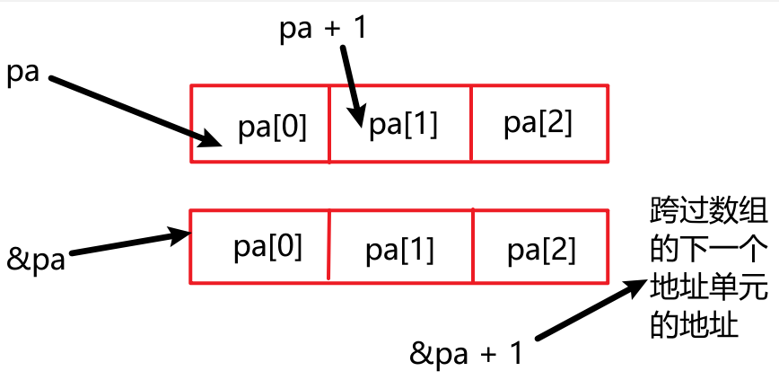

# 第 7 章 函数——C++的编程模块


## 7.10 函数指针

### 7.10.1 函数指针的基础知识

1. 获取函数的地址：

   使用函数名即可，后面不跟参数。即：

   ```c++
   // think()是一个函数，think则是该函数的地址
   process(think)
   ```

2. 声明一个函数指针

   ```c++
   // 函数原型是double pam(int n);
   // 则函数指针为
   double (*pf)(int);
   ```

3. 使用指针来调用函数

   ```c++
   double pam(int);
   double (*pf)(int);
   // pf now points to the pam() function
   pf = pam;
   // call pam() using the function name
   double x = pam(4);
   // call pam() using the pointer pf
   double y = (*pf)(5);
   ```

### 7.10.2 函数指针示例

```c++
// 7.18 fun_ptr.cpp -- pointers to functions
#include <iostream>

using namespace std;

double betsy(int lns);
double pam(int lns);
void estimate(int lines, double (*pf)(int));

int main(void)
{
    int code;
    cout << "How many lines of code do you need? ";
    cin >> code;
    cout << "Here's Betsy's estimate:" << endl;
    estimate(code, betsy);
    cout << "Here's Pam's estimate:" << endl;
    estimate(code, pam);

    return 0;
}

double betsy(int lns)
{
    return 0.05 * lns;
}

double pam(int lns)
{
    return 0.03 * lns + 0.0004 * lns * lns;
}

void estimate(int lines, double (*pf)(int))
{
    cout << lines << " lines will take "
         << (*pf)(lines) << " hour(s)" << endl;
}
```

### 7.10.3 深入探讨函数指针

```c++
// 7.19 arfupt.cpp -- an arrary of function pointers
#include <iostream>

using namespace std;

const double *f1(const double *ar, int n);
const double *f2(const double ar[], int n);
const double *f3(const double ar[], int n);

int main(void)
{
    double av[3] = {1112.3, 1542.6, 2227.9};

    // p1: pointer to a function
    // (*p1）== f1
    const double *(*p1)(const double *, int) = f1;
    // C++11 automatic type deduction
    // const double *(*p2)(const double *, int) = f2;
    auto p2 = f2;
    cout << "Using pointers to functions: " << endl;
    cout << "Address\t\t\tValue" << endl;
    // (*p1)(av, 3) == f1(av, 3)
    cout << (*p1)(av, 3) << ": \t\t" << *(*p1)(av, 3) << endl;
    // p2 == (*p2)   p2(av, 3) == f2(av, 3)
    cout << p2(av, 3) << ": \t\t" << *p2(av, 3) << endl;
    cout << "------------------------------" << endl;
    // pa(pb) is an array of pointers
    const double *(*pa[3])(const double *, int) = {f1, f2, f3};
    auto pb = pa;

    for (int i = 0; i < 3; i++)
    {
        cout << pa[i](av, 3) << ": \t\t" << *pa[i](av, 3) << endl;
    }

    for (int i = 0; i < 3; i++)
    {
        cout << pb[i](av, 3) << ": \t\t" << *pb[i](av, 3) << endl;
    }
    cout << "------------------------------" << endl;

    // pc is a pointer to an array of function pointers
    // C++11 can use the following code instead
    // const double *(*(*pc)[3])(const double *, int) = &pa;
    auto pc = &pa;
    const double *(*(*pd)[3])(const double *, int) = &pa;
    // (*pc) == pa -->(*pc)[0](av,3) == pa[0](av,3)
    cout << (*pc)[0](av, 3) << ": \t\t" << *(*pc)[0](av, 3) << endl;
    // (*pd)[1](av,3)== pa[1](av,3) == f2(av,3)
    const double *pdb = (*pd)[1](av, 3);
    cout << pdb << ": \t\t" << *pdb << endl;
    return 0;
}

const double *f1(const double *ar, int n)
{
    return ar;
}

const double *f2(const double ar[], int n)
{
    return ar + 1;
}

const double *f3(const double ar[], int n)
{
    return ar + 2;
}
```

下面两种形式的区别：

```c++
// 1 是取第2个元素的地址
(*pa[1])(av,3)
// 2 是取第2个元素的值
*pa[1](av,3)
```

pa(它是数组名，表示地址)和&pa之间的差别。

pa是数组第一个元素的地址，即&pa[0]，是单个指针的地址。但&pa是整个数组（即三个指针块的地址）。虽然pa和&pa的数字值相同，但它们的类型不同。

一种差别是，**pa+1为数组中下一个元素的地址**，而&pa+1为**数组pa后面一个12字节内存块的地址（假定地址为4字节）**；

另一种差别是，要得到第一个元素的值，只需要对pa解除一次引用，但需要对&pa解除两次引用：

```c++
**&pa == *pa == pa[0]
```



### 7.10.4 使用typedef进行简化

除了auto外，C++还提供了其他简化声明的工具。关键字typedef能够创建类型别名：

```c++
// real不在是double类型的变量，而是double的别名
typedef double real;
```

使用函数指针的别名：

```c++
// p_fun now a type name
typedef const double *(*p_fun)(const double *, int);
// p1 points to the f1() function
p_fun p1 = f1;
```

