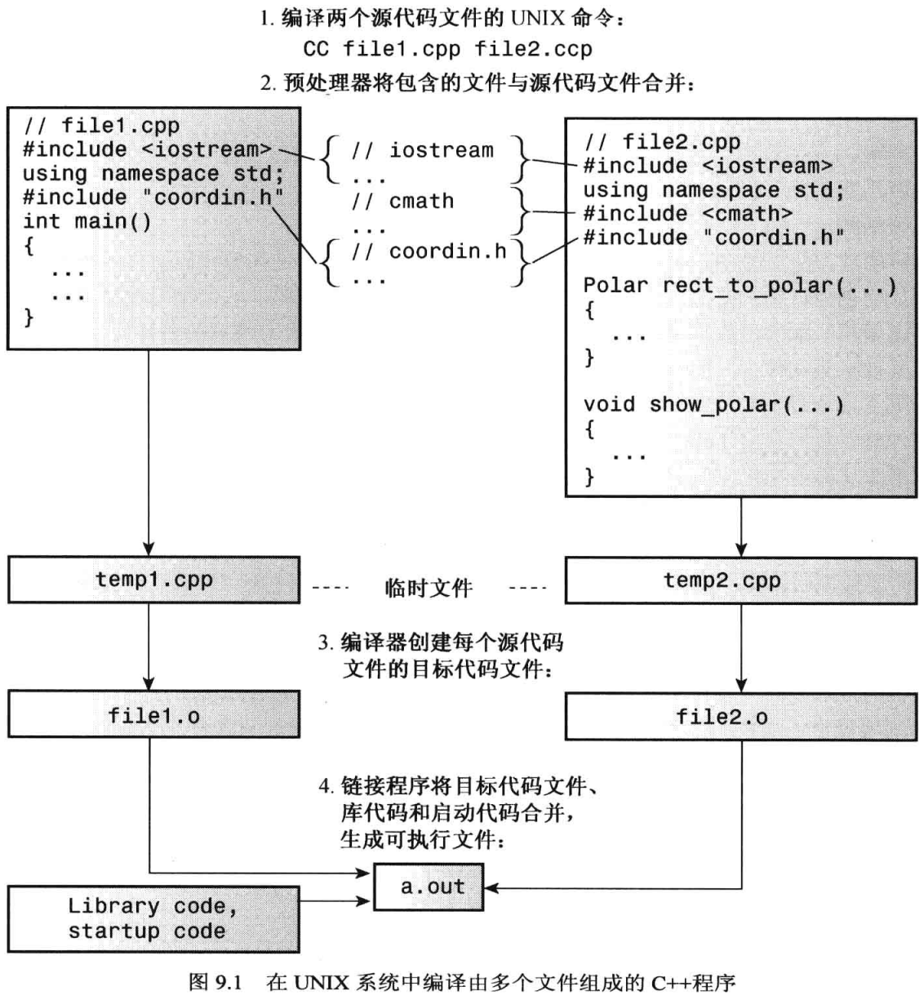

# 第 9 章 内存模型和名称空间

## 9.1 单独编译

头文件中一般包含的内容的

- 函数原型
- 使用#define 或 const 定义的符号常量
- 结构声明
- 类声明
- 模板声明
- 内联函数

_注：在包含自己的头文件时，应使用引号而不是尖括号。_



下面的代码片段意味着仅当以前没有预处理器编译指令`#define`定义名称 `COORDIN_H_`时，才处理`#ifndef`和`#endif`之间的语句：

```cpp
#ifndef COORDIN_H_
...
#endif
```

_注：这种方式并不能防止编译器将文件包含两次，而只是让它忽略除第一次包含之外的所有内容。_

C++不同的方案存储数据，这些方案的区别在于数据在内存中的时间。

- **自动存储持续性**：在函数定义中声明的变量（包含函数参数）的储存持续性为自动的。它们在程序开始执行其所属的函数或代码块时被创建，在执行完函数或代码块时，它们使用的内存被释放。
- **静态存储持续性**：在函数定义外定义的变量和关键字`static`定义的变量的存储持续性都为静态。它们在程序整个运行过程中都存在。C++有三种存储持续性为静态的变量。
- **线程存储持续性**：如果变量使用`thread_local`声明的，则其生命周期与所属的线程一样长。
- **动态存储持续性**：用`new`运算符分配的内存将一直存在，直到`delete`运算符将其释放或程序结束为止。也称自由存储(free store)或堆(heap)。
